# 🛒 MERN E-Commerce Application

A full-stack MERN (MongoDB, Express, React, Node.js) e-commerce web application where users can browse products, add items to cart, add items to wishlist, place orders, and track their purchases.
This project demonstrates complete frontend–backend integration, REST API design, authentication handling, and database management.

## 🚀 Features

* 👤 User Signup & Login authentication
* 🛍 Browse product catalog
* 🛒 Add / Remove items from cart
* 💖 Add / Remove items from wishlist
* 📦 Place orders
* ⭐ Product reviews and ratings
* 🚚 Track order status
* 🔎 Filter products by:

  * Category
  * Product name (search)
  * Color
  * Brand
  * Newly launched products
  * Sale products
  * Top purchasing products
* 💳 Secure online payment using Razorpay
* 📞 Customer calling/support feature
* 🔐 Secure backend API with authentication
* 🔄 Real-time frontend–backend communication using Axios
* 📱 Fully responsive mobile UI


## 🧰 Tech Stack

### Frontend

* React.js
* JavaScript (ES6+)
* Tailwind CSS
* Axios

### Backend

* Node.js
* Express.js

### Database

* MongoDB

### Other Tools

* Git & GitHub
* REST API architecture


## 📁 Project Structure

```
ecommercenew/
│
├── backend/        # Node.js + Express API and database logic
├── frontendnew/    # React frontend application
├── screenshots/
├── README.md
```

## ⚙️ Installation & Setup

### 1️⃣ Clone the repository

```
git clone https://github.com/sayantinimukherjee79/ecommercenew.git
cd ecommercenew
```

---

### 2️⃣ Setup Backend

```
cd backend
npm install
npm start
```

Backend will run on:

```
http://localhost:5000
```

---

### 3️⃣ Setup Frontend

Open a new terminal:

```
cd frontendnew
npm install
npm run dev
```

Frontend will run on:

```
http://localhost:5173
```

---

## 🔐 Environment Variables

Create a `.env` file inside **backend** folder and add:

```
PORT=5000
MONGO_URI=your_mongodb_connection_string
JWT_SECRET=your_jwt_secret

CLOUDINARY_CLOUD_NAME=your_cloudinary_name
CLOUDINARY_API_KEY=your_cloudinary_key
CLOUDINARY_API_SECRET=your_cloudinary_secret

RAZORPAY_KEY_ID=your_razorpay_key
RAZORPAY_KEY_SECRET=your_razorpay_secret
```


## 📸 Screenshots
├── screenshots/ 
  ├── AboutPage.png 
  ├── CartPage.png 
  ├── Contactpage.png 
  ├── Homepage.png 
  ├── Loginpage.png 
  ├── MyOrderPage.png 
  ├── OrderConfirmationPage.png 
  ├── OrderDetailsPage.png 
  ├── PaymentSuccessfulPage.png 
  ├── ProductDetailsPage.png 
  ├── ProductReviewPage.png 
  ├── Shoppage.png 
  ├── SignUpPage.png 
  │── Wishlistpage.png


## 📸 Then display Screenshots:

```
### 🏠 Home Page

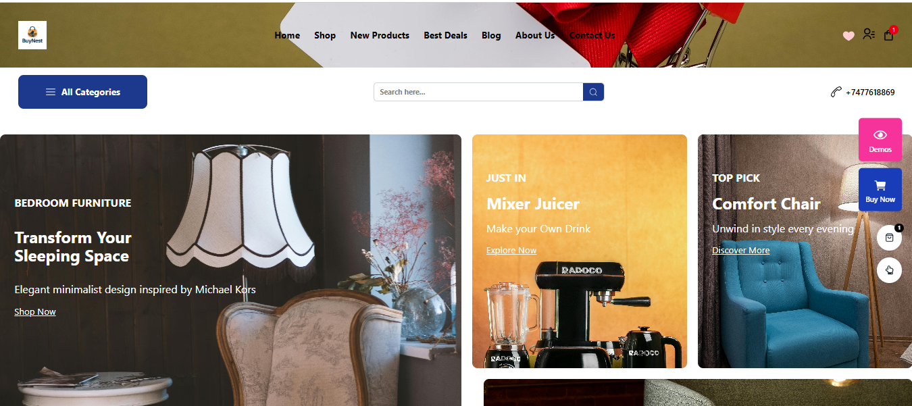

### 🛍 Shop Page

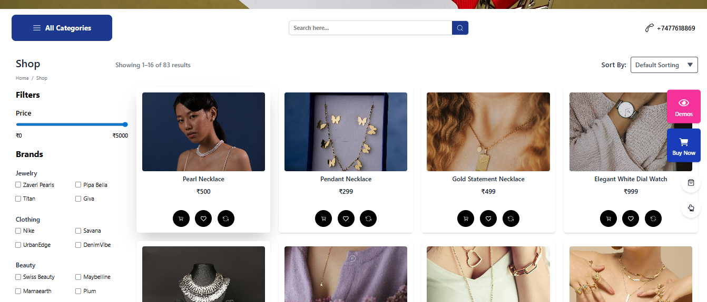

### 🔐 Login Page

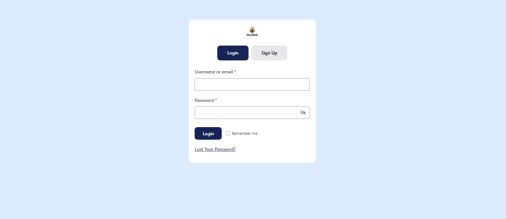

### 📝 Signup Page

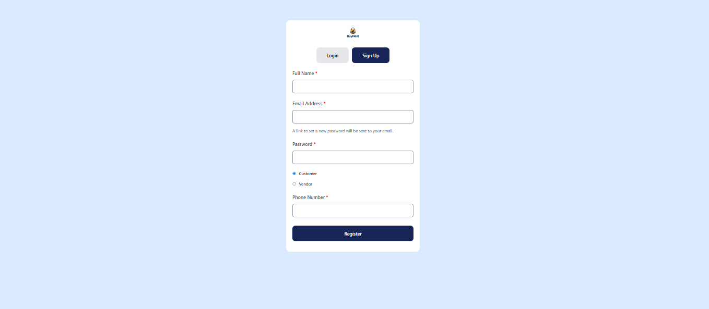

### 📦 Product Details

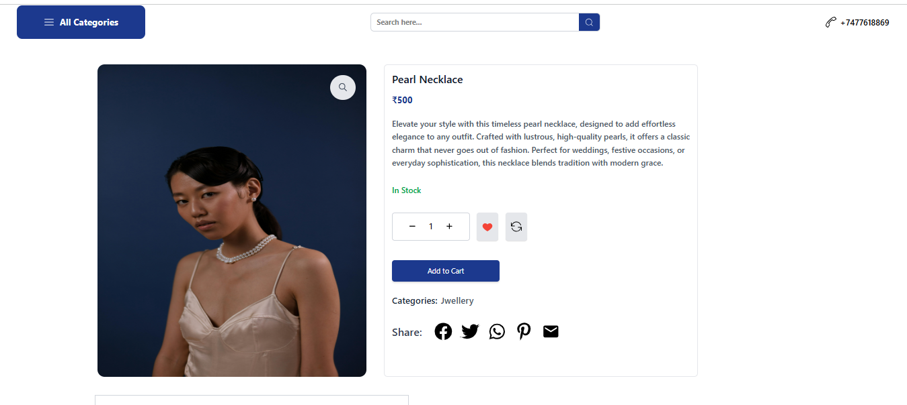

### ⭐ Product Review

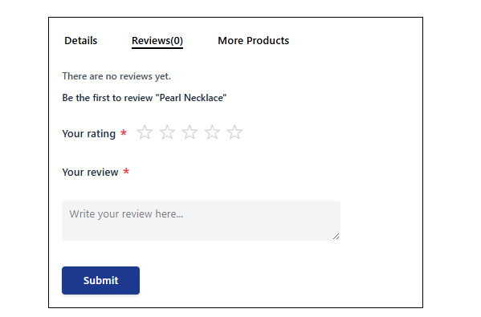

### 🛒 Cart Page

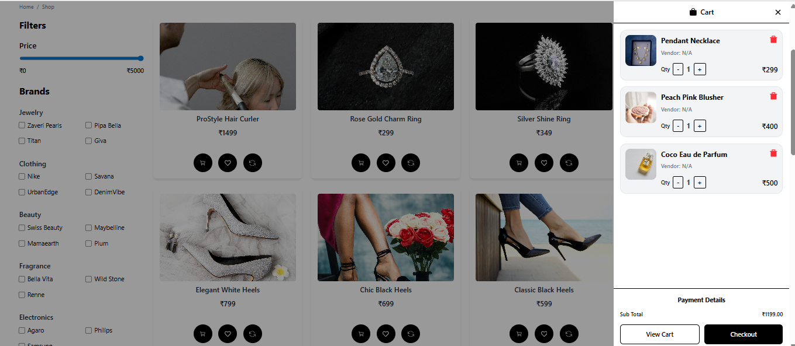

### 💖 Wishlist Page

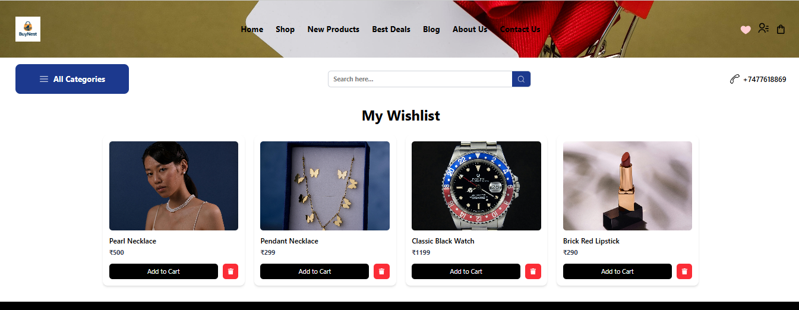

### 📦 My Orders

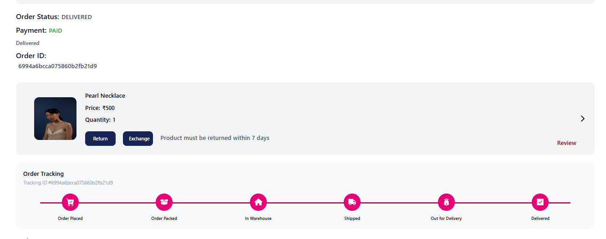

### 📄 Order Details

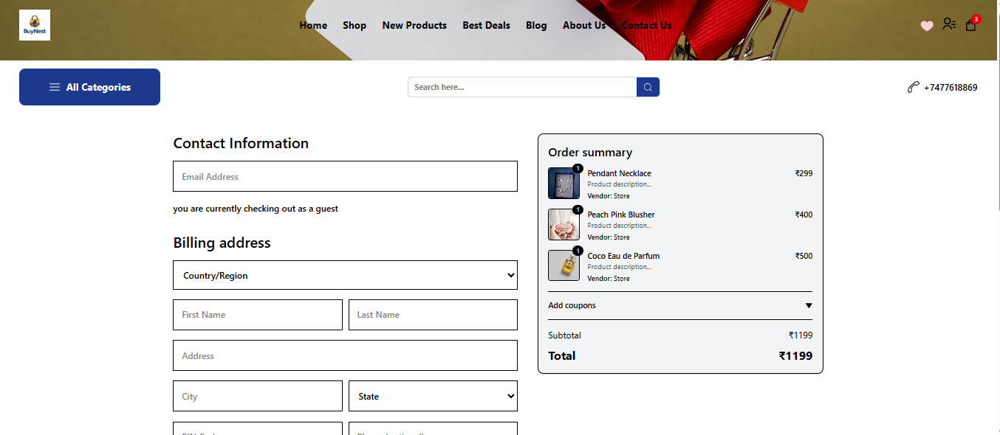

### ✅ Order Confirmation

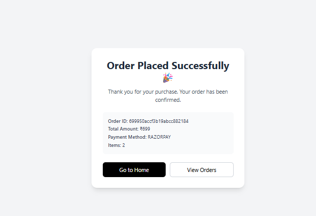

### 💳 Payment Success

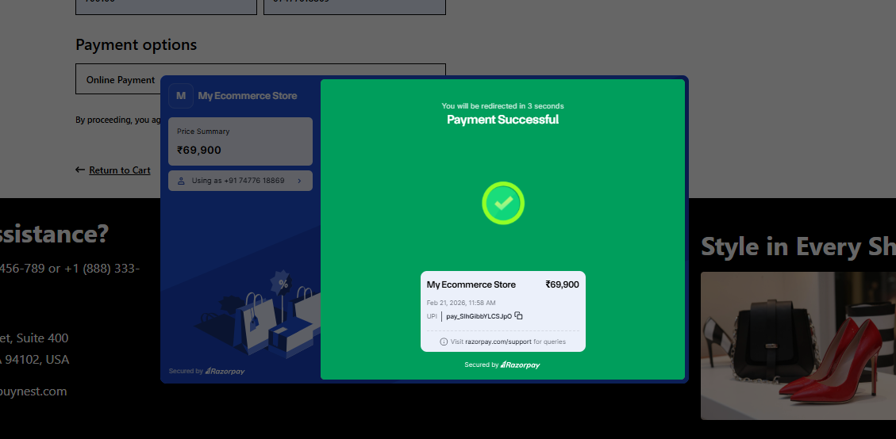

### 📞 Contact Page

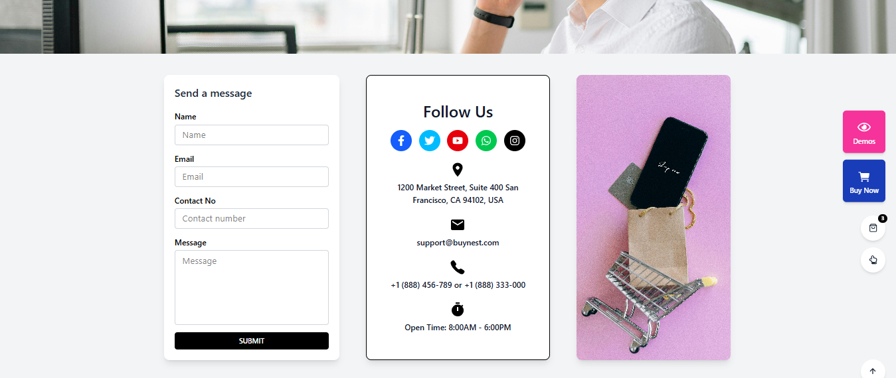

### ℹ About Page


```

---

## 🔗 API Endpoints (Sample)

```
POST   /api/auth/register     → Register user
POST   /api/auth/login        → Login user
GET    /products              → Fetch all products
POST   /api/cart/add          → Add to cart
POST   /api/orders/place      → Place order
```

---

## Live Demo

Check out the live project here: [Live Demo](https://ecommercenew-alpha.vercel.app/)

## 🧠 Challenges Faced

* Handling authentication and protecting routes
* Managing asynchronous API calls between frontend and backend
* Designing MongoDB schema for users, products, and orders
* Maintaining global cart state in frontend

---

## 🔮 Future Improvements

* 🛠 Admin dashboard for product management
* 🤖 AI-powered chatbot for handling customer queries and support
* 🔔 Email/SMS notifications for order updates


---

## 👩‍💻 Author

**Sayantini Mukherjee**

* GitHub: https://github.com/sayantinimukherjee79
* Email: sayantinimukherjee79@gmail.com

---

## 📜 License

This project is for educational and learning purposes.
